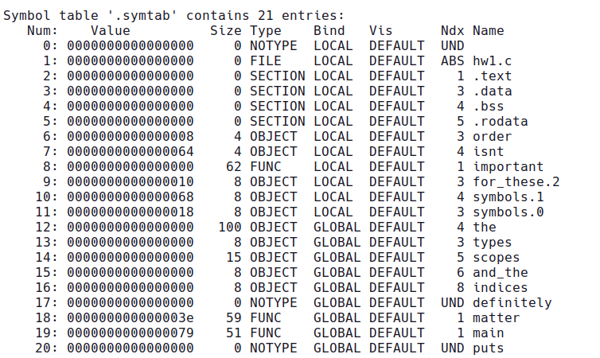

# Homework 1

We will explore concept of symbol table within this assignment.
Your goal is to generate symbol table as shown below:



Use Makefile for compiling and testing your code.

```
make test
```

For additional requirements refer homework writeup from piazza.

